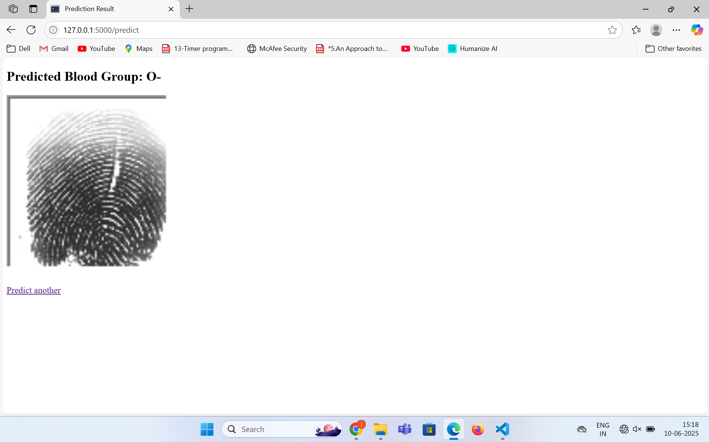
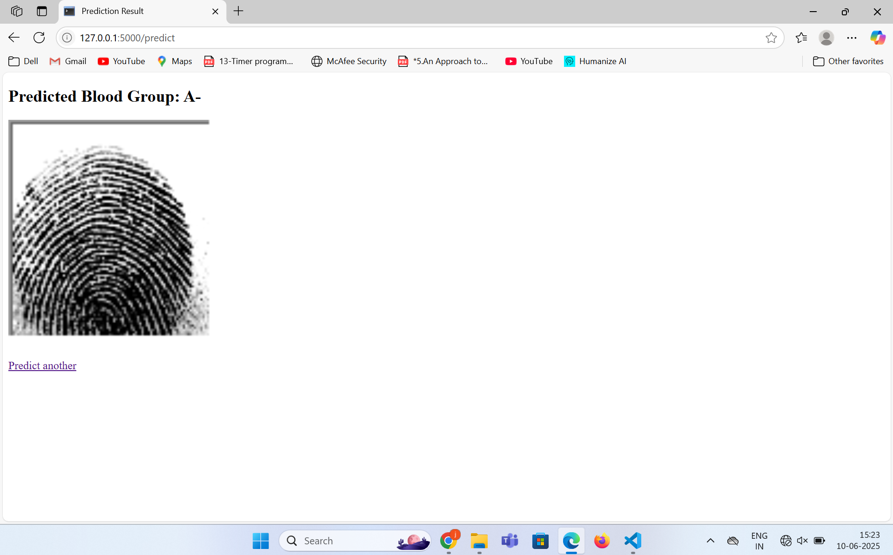
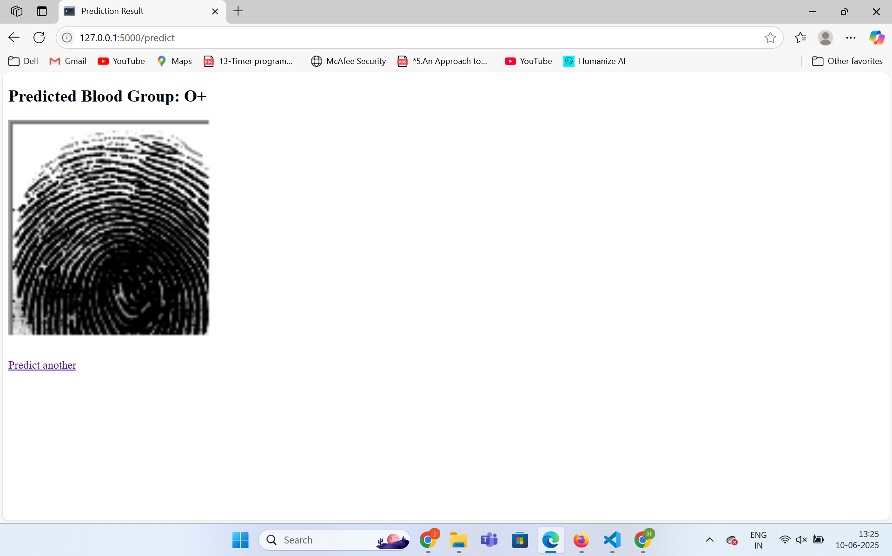
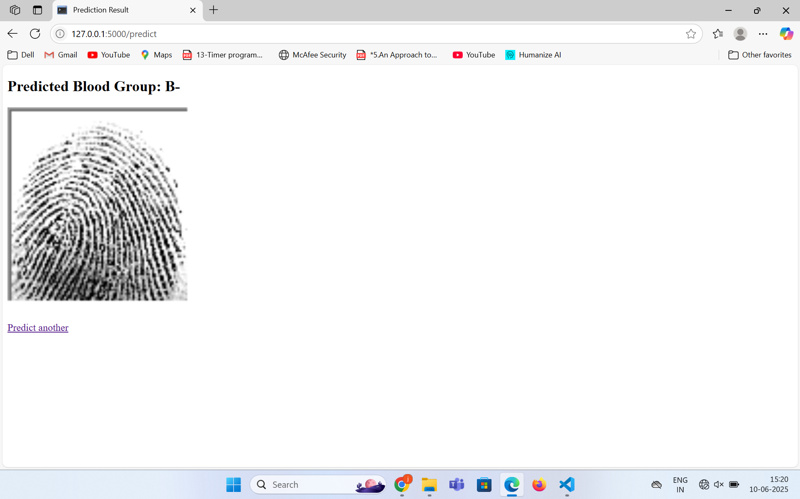
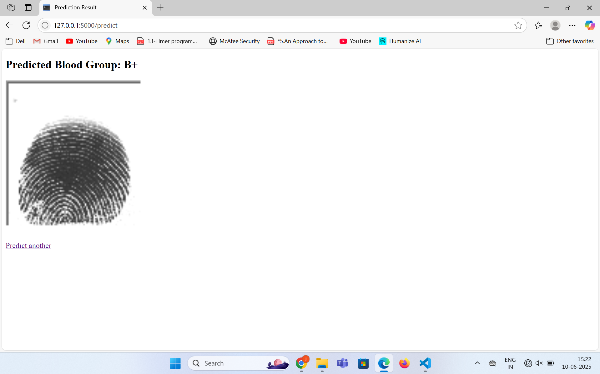

# 🧬 Fingerprint-Based Blood Group Detection using CNN

This project implements a Convolutional Neural Network (CNN) model using TensorFlow and OpenCV to detect human blood groups from fingerprint images. It includes image preprocessing, model training, evaluation, and saving the final model.

## 📂 Dataset Structure

dataset/
├── A+/
├── A-/
├── B+/
├── B-/
├── AB+/
├── AB-/
├── O+/
└── O-/

## 📸 Sample Dataset Screenshot

---

## 📌 Project Workflow

### 1. **Image Preprocessing**

- Read and resize each image to `128x128`.
- Normalize pixel values to the range `[0, 1]`.
- Assign a label to each image based on folder name.
- Convert labels to one-hot encoded vectors.
- Save the processed data as `.npy` files.

**Screenshot:**

### 2. **Model Architecture**

A simple CNN model with the following layers:

- **Conv2D** → ReLU
- **MaxPooling2D**
- **Conv2D** → ReLU
- **MaxPooling2D**
- **Flatten**
- **Dense** → ReLU
- **Dropout**
- **Dense (Softmax)**

**Screenshot:**

### 3. **Model Training**

- Model is trained using 80% training and 20% validation data.
- Loss function: `categorical_crossentropy`
- Optimizer: `Adam`
- Epochs: 10
- Batch Size: 32

model.fit(X_train, y_train, epochs=10, batch_size=32, validation_data=(X_val, y_val))

4. Model Evaluation
Loads the trained .h5 model.
Evaluates using a validation split via ImageDataGenerator.

5. Model Saving
Final model is saved as: blood_group_cnn_model.h5
Use load_model() from Keras to reload the trained model.

⚙️ Requirements
Install the required libraries with: pip install tensorflow opencv-python numpy scikit-learn

📁 File Structure

├── dataset/
├── screenshots/
│   ├── dataset_structure.png
│   ├── preprocessing_output.png
│   ├── model_summary.png
│   ├── training_accuracy.png
│   └── confusion_matrix.png
├── preprocess.py
├── train_model.py
├── evaluate_model.py
├── X_train.npy
├── X_val.npy
├── y_train.npy
├── y_val.npy
├── blood_group_cnn_model.h5
└── README.md
📊 Results
Trained with 10 epochs

Achieved decent accuracy on validation set of upto 88%

